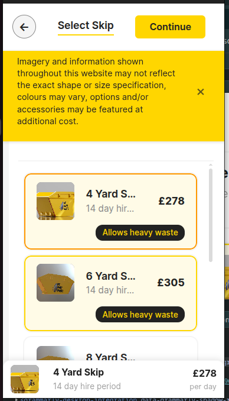

## Describing Redesign Approach
* The color palette is related to the service offered by the project.

* The header contains back/continue buttons and the current step of the multistep booking process. Additionally, the previous and next step are shown.

* The new layout splits horizontally the main content area. On the left, the user can scroll to see the options, while on the right side, they see the current selected element. 

* On Top of the list, there is a combobox which allows the user to sort the list by size and price.

* The warning related to images is displayed as a notification instead of using the space of the current view.

* It has a loader while making Requests to the API.

* It handles errors if API can't be accessed.

* It has a cache of images for better performance, and reduces calls to the API.

## For the mobile version
* The back button is reduced to a circle with an arrow.

* The previous and next steps are removed.

* The sorting combobox takes 100% width.

* There is a sticky footer to display the current selected item.

## Improvements over original design

* Colors related to the service
* Allows user to sort and access more quickly the skip he needs.
* The current selected item is clearly visible on the right of the screen.
* Additional performance on image, error handling, and loading were introduced.

## Screenshots
### Desktop

### Mobile
* 
